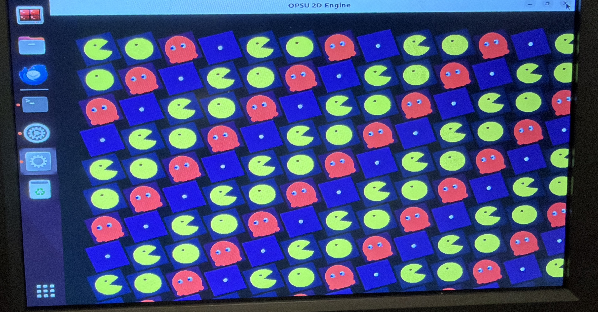

# 🟡 OP5U 2D Engine

A lightweight **OpenGL ES 3.1 sprite engine** built from scratch for the **Orange Pi 5 Ultra (RK3588S)**.  
Currently rendering thousands of animated, rotating sprites at 60 FPS using the open-source **Mesa Panfrost** GPU driver.



---

## 🧩 Features
- GLES 3.1 renderer (Panfrost driver)
- Instanced sprite rendering (~10 000 sprites)
- Flip-book sprite animation (frame-timed UV swapping)
- Camera pan + zoom + VSync toggle
- Per-sprite continuous rotation
- Real-time FPS display & Pac-Man animation speed control
- Texture atlas system (512 × 512)
- Runs full-speed on Ubuntu Jammy GNOME Desktop

---

## 🎮 Controls

| Key | Action |
|:----|:--------|
| **W / A / S / D** or **Arrow keys** | Pan camera |
| **Q / E** | Zoom out / in |
| **R** | Reset camera position and zoom |
| **[ / ]** | Decrease / increase Pac-Man animation speed |
| **V** | Toggle VSync on / off |
| **ESC** | Quit |

The console prints live FPS, zoom level, camera position, and current animation rate.

---

## ⚙️ Hardware
**Orange Pi 5 Ultra (16 GB RAM)**  •  NVMe SSD  •  Ubuntu 22.04 (Jammy) Desktop GNOME  

GPU: Mali-G610 MP4 via open-source Mesa Panfrost driver

---

## 🧠 Build Instructions (Orange Pi 5 Ultra)

```bash
# 1. Clone the repo
git clone https://github.com/jmstein7/op5u-2d-engine.git
cd op5u-2d-engine

# 2. Install dependencies
sudo apt install -y libsdl2-dev libsdl2-image-dev build-essential cmake mesa-utils

# 3. Build
mkdir -p build && cd build
cmake ..
make -j$(nproc)

# 4. Run (from build dir so ../assets/ resolves)
./op5u
💡 If you run from another directory, set an explicit asset path:

bash
Copy code
export OP5U_ASSETS=~/op5u_2d_engine/assets
./build/op5u
🧩 Current Features
GPU-instanced sprite rendering

Flip-book animation system (frame-timed UV swapping)

Camera pan + zoom controls

Adjustable Pac-Man animation rate

Real-time FPS and VSync toggle

Clean .gitignore and build structure

🗺️ Next Steps
Tilemap rendering with view-frustum culling

Sprite depth sorting and parallax layers

On-screen text (SDL_ttf) for HUD / FPS display

Multi-atlas texture batching

Audio playback via SDL2_mixer

Full demo: Pac Field

⚙️ Environment
Component	Version
OS	Ubuntu 22.04 Jammy Desktop (GNOME, NVMe install)
GPU Driver	Mesa 23.x (Panfrost OpenGL ES 3.1)
Compiler	GCC 13.3
Libraries	SDL2 2.0.5 · SDL_Image 2.0.5 · CMake 3.22

🔗 Project Links
Hackaday Project Page: https://hackaday.io/project/204239-op5u-orange-pi-5-ultra-2d-game-engine

GitHub Repository: https://github.com/jmstein7/op5u-2d-engine

📄 License
MIT License © 2025 Jonathan Stein

yaml
Copy code
